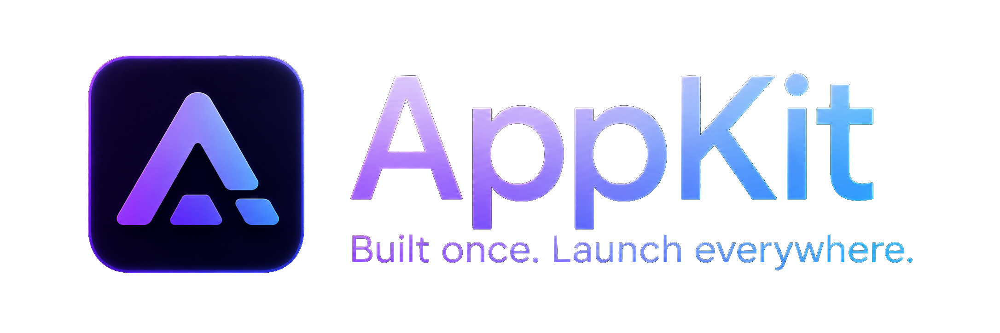
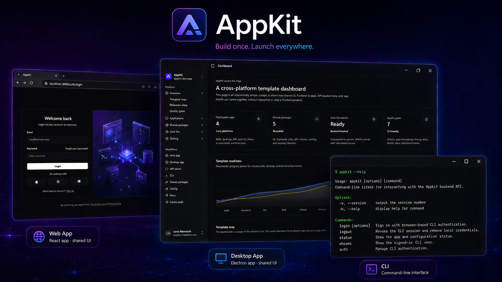

<div align="center">



# AppKit

**A professional TypeScript monorepo starter kit for building cross-platform apps with a shared backend.**

[](https://github.com/LucaMezz/electron-boilerplate/actions/workflows/ci.yml)
[](https://github.com/LucaMezz/electron-boilerplate/stargazers)
[](./LICENSE)
[](https://pnpm.io)
[](https://turbo.build/repo)
[](https://www.typescriptlang.org)

</div>

---

AppKit is a professional TypeScript monorepo starter kit for building a cross-platform application with a shared backend, shared frontend packages, and a maintainable developer workflow.

It is designed to support a real product-style architecture where a web app, desktop app, backend API, and shared packages can evolve together without duplicating code or letting the monorepo become messy over time.

## Overview

AppKit provides a foundation for building applications that share logic across multiple runtimes:

- A backend API application.
- A web application.
- A desktop application.
- A CLI application.
- Shared UI components.
- Shared core logic.
- A shared API client.
- Shared frontend flows.
- Shared runtime configuration.
- Consistent tooling for builds, checks, dependency management, commit quality, and architecture boundaries.

The goal of this repository is not just to run multiple apps side by side. It is to provide a maintainable monorepo structure where each app and package has a clear purpose, clear boundaries, and predictable workflows.

<div align="center">



</div>

## Tech stack

AppKit combines application frameworks, shared package tooling, and repository quality tools to support cross-platform development from a single workspace.

### Runtime, apps, and UI

| Tool                                                                                                                           | Purpose                                                                                                  |
| ------------------------------------------------------------------------------------------------------------------------------ | -------------------------------------------------------------------------------------------------------- |
| [ TypeScript](https://www.typescriptlang.org/) | Primary language for apps, packages, configuration, and shared types.                                    |
| [ React](https://react.dev/)                             | Shared UI foundation for the web app and desktop renderer.                                               |
| [ Electron](https://www.electronjs.org/)           | Desktop runtime for `apps/desktop`.                                                                      |
| [ Vite](https://vite.dev/)                                 | Fast frontend build tooling for the web app and Electron renderer.                                       |
| [ Tailwind CSS](https://tailwindcss.com/)   | Utility-first styling system for shared UI and app interfaces.                                           |
| [ shadcn/ui](https://ui.shadcn.com/)              | Component patterns used as the basis for reusable UI primitives in `@appkit/ui`.                         |
| [ Storybook](https://storybook.js.org/)          | Isolated component workbench for developing, previewing, and documenting shared `@appkit/ui` components. |

### Backend and data

| Tool                                                                                                                       | Purpose                                                      |
| -------------------------------------------------------------------------------------------------------------------------- | ------------------------------------------------------------ |
| [ Express](https://expressjs.com/)               | Backend HTTP server framework for `apps/api`.                |
| [ PostgreSQL](https://www.postgresql.org/) | Relational database target for backend persistence.          |
| [ Docker](https://www.docker.com/)                 | Local infrastructure and API/database development workflows. |
| [ Zod](https://zod.dev/)                                 | Runtime validation and shared schema definitions.            |

### Monorepo and developer tooling

| Tool                                                                                                                                                   | Purpose                                                                               |
| ------------------------------------------------------------------------------------------------------------------------------------------------------ | ------------------------------------------------------------------------------------- |
| [ pnpm](https://pnpm.io/)                                                          | Workspace package manager.                                                            |
| [ Turborepo](https://turbo.build/repo)                                   | Task orchestration, dependency-aware execution, and caching across apps and packages. |
| [ Lefthook](https://lefthook.dev/)                                                   | Fast Git hooks for pre-commit, commit-msg, and pre-push checks.                       |
| [ Oxlint / oxfmt](https://oxc.rs/)                                                | Fast linting and formatting.                                                          |
| [ Knip](https://knip.dev/)                                                          | Detects unused files, exports, scripts, dependencies, and binaries.                   |
| [ syncpack](https://syncpack.dev/)                                              | Keeps dependency versions consistent across workspace packages.                       |
| [ commitlint](https://commitlint.js.org/)                                     | Validates Conventional Commit messages.                                               |
| [ czg / cz-git](https://cz-git.qbb.sh/)                                           | Interactive Conventional Commit prompt.                                               |
| [ dependency-cruiser](https://github.com/sverweij/dependency-cruiser) | Enforces architecture boundaries between apps and packages.                           |
| [ Renovate](https://docs.renovatebot.com/)                              | Automates dependency update pull requests with grouping and dashboard approval.       |

## Repository structure

```text
.
├── apps/
│   ├── api/          # Backend API application
│   ├── cli/          # Command-line application
│   ├── desktop/      # Cross-platform desktop application
│   └── web/          # Web application
│
├── packages/
│   ├── api-client/   # Shared client for communicating with the API
│   ├── config/       # Shared config defaults, env parsing, and URL helpers
│   ├── core/         # Shared framework-agnostic business/domain logic
│   ├── frontend/     # Shared frontend routes, pages, guards, and flows
│   └── ui/           # Shared React UI components built on shadcn-ui
│
├── docs/             # Project documentation
├── package.json      # Root workspace scripts and tooling
├── pnpm-workspace.yaml
├── turbo.json
├── lefthook.yml
├── renovate.json
├── .syncpackrc.json
└── .dependency-cruiser.cjs
```

## Applications

### `apps/api`

The API application is the shared backend for the project.

It is responsible for server-side application logic, API routes, authentication/session-related backend concerns, database access, middleware, and backend configuration.

The API should not depend on frontend-specific packages such as `@appkit/ui`.

### `apps/web`

The web application is the browser-based frontend.

It consumes shared packages such as:

- `@appkit/ui`
- `@appkit/core`
- `@appkit/api-client`

The web app should not import from the desktop app or API app directly. Shared code should be moved into `packages/*`.

### `apps/desktop`

The desktop application is the cross-platform desktop client.

It uses Electron-style separation between main, preload, shared IPC contracts, and renderer code.

The desktop app can consume shared packages such as:

- `@appkit/ui`
- `@appkit/core`
- `@appkit/api-client`

Desktop-specific code should stay inside `apps/desktop`. Shared code that can also be used by the web app should live in `packages/*`.

### `apps/cli`

The CLI application is the terminal client for AppKit.

It owns command registration, terminal UX, local CLI config, credential storage abstractions, and browser-based CLI authentication orchestration.

The CLI should communicate with the backend through `@appkit/api-client`. It should not import UI, shared frontend flows, or implementation code from other apps.

## Shared packages

### `packages/core`

Shared framework-agnostic logic.

This package should remain independent of React, Electron, Express, browser APIs, and app-specific code. It is the right place for shared domain types, validation helpers, constants, pure utilities, and other reusable logic.

`@appkit/core` should not depend on:

- `@appkit/ui`
- `@appkit/api-client`
- `apps/api`
- `apps/web`
- `apps/desktop`
- `apps/cli`

### `packages/config`

Shared runtime configuration defaults and helpers.

This package owns local port defaults, URL helpers, env var names, server env parsing, and client-safe config exports. Use it instead of hardcoding local URLs, ports, or API base URLs in app/package source code.

Browser-safe code should import from `@appkit/config/client`. Server-only code can import from `@appkit/config/server`.

### `packages/frontend`

Shared React frontend routes, pages, guards, and application flows.

This package lets `apps/web` and the desktop renderer stay thin platform hosts. Shared login pages, dashboard routes, auth guards, and API-backed frontend flows belong here when they can be reused across frontend targets.

`@appkit/frontend` may use `@appkit/ui`, `@appkit/core`, and `@appkit/api-client`, but it must not import deployable app implementation code.

### `packages/ui`

Shared React UI components.

This package contains reusable components, hooks, and styling utilities that can be used by both the web and desktop renderer applications.

React and React DOM are treated as peer dependencies so that each consuming app owns the actual runtime version.

`@appkit/ui` should not import from apps or server-only modules.

### `packages/api-client`

Shared API client package.

This package provides client-side helpers for communicating with the backend API. It is intended to be reusable across frontend targets.

`@appkit/api-client` should not import from apps.

## Package boundaries

The monorepo follows these architecture rules:

- Apps must not import from other apps.
- Shared code belongs in `packages/*`.
- `packages/core` must remain framework-agnostic.
- `packages/ui` must not import app code or server-only code.
- `packages/api-client` must not import app code.
- `packages/frontend` must not import app code.
- `packages/config` must not import app code or frontend/UI layers.
- `apps/cli` must not import UI or shared frontend packages.
- Source code must not import generated build output such as `dist`, `.next`, `.vite`, `build`, or `out`.

These rules are enforced with dependency-cruiser:

```bash
pnpm deps:arch
```

## Community and contribution docs

- [Contributing guide](./CONTRIBUTING.md)
- [Code of Conduct](./CODE_OF_CONDUCT.md)
- [Security policy](./SECURITY.md)
- [Support guide](./SUPPORT.md)
- [Governance](./GOVERNANCE.md)
- [CLI authentication](./docs/cli-auth.md)

## Internal import conventions

AppKit uses package-level import conventions to keep aliases predictable.

### Cross-package imports

Use package names when importing across workspace packages:

```ts
import { Button } from "@appkit/ui";
import { someCoreHelper } from "@appkit/core";
import { apiClient } from "@appkit/api-client";
```

### Package-internal imports

Shared packages use `package.json#imports` for package-local imports:

```ts
import { cn } from "#/utils/cn";
```

This avoids collisions between app-local aliases and package-local aliases.

### App-local imports

Apps may use their own local aliases for app-specific source code.

For example, app code can use aliases for local modules, but those aliases should not leak into shared packages.

## Tooling

This repo includes a set of tools intended to keep the monorepo maintainable as it grows.

### pnpm workspaces

The repository uses pnpm workspaces for package management.

Internal workspace dependencies should use:

```json
"workspace:*"
```

### Turborepo

Turborepo orchestrates tasks across apps and packages.

It is used to run builds, checks, typechecks, tests, package tasks, and other workspace commands in dependency-aware order.

Common commands:

```bash
pnpm build
pnpm check
pnpm test:run
pnpm package
```

### Lefthook

Lefthook manages local Git hooks.

It is used for:

- Commit message validation.
- Pre-commit checks.
- Pre-push checks.

### Oxlint and oxfmt

Oxlint and oxfmt provide fast linting and formatting.

Run the main check pipeline with:

```bash
pnpm check
```

### Knip

Knip detects unused files, exports, dependencies, scripts, and binaries.

Run:

```bash
pnpm knip
```

### syncpack

syncpack keeps dependency versions consistent across the workspace.

Run:

```bash
pnpm deps:lint
```

To fix dependency version drift:

```bash
pnpm deps:fix
pnpm install
```

To format package files:

```bash
pnpm deps:format
```

### commitlint and czg

Commit messages follow Conventional Commits.

Use the interactive commit prompt:

```bash
pnpm commit
```

Examples:

```text
feat(api): add user session endpoint
fix(desktop): handle failed auth redirects
refactor(repo): migrate internal aliases to package imports
chore(deps): add renovate configuration
ci: add dependency architecture check
```

Commit messages are validated automatically through Lefthook.

### dependency-cruiser

dependency-cruiser enforces architecture rules across the monorepo.

Run:

```bash
pnpm deps:arch
```

This checks that apps and packages follow the intended dependency boundaries.

### Renovate

Renovate automates dependency update pull requests.

Major updates require manual approval through the Dependency Dashboard. This prevents risky upgrades such as major framework, runtime, package manager, or Electron changes from being opened unexpectedly.

## Getting started

### Prerequisites

Install:

- Node.js
- pnpm
- Git
- Docker, if running database or API services through Docker

### Install dependencies

```bash
pnpm install
```

### Run development tasks

```bash
pnpm dev
```

Depending on the current scripts and filters, you can also run individual apps through pnpm filters.

Examples:

```bash
pnpm --filter @appkit/api dev
pnpm --filter @appkit/web dev
pnpm --filter @appkit/desktop dev
```

### Build the monorepo

```bash
pnpm build
```

### Run checks

```bash
pnpm check
```

### Run tests

```bash
pnpm test:run
```

### Package the desktop app

```bash
pnpm package
```

## Quality gates

Before code is merged, the repo is expected to pass:

```bash
pnpm deps:lint
pnpm deps:arch
pnpm knip
pnpm check
pnpm test:run
pnpm build
```

The exact CI workflow may run these as separate steps.

## Dependency management workflow

When adding or updating dependencies:

1. Add the dependency to the package that actually uses it.
2. Use `workspace:*` for internal workspace packages.
3. Run syncpack:

   ```bash
   pnpm deps:lint
   ```

4. If syncpack reports drift:

   ```bash
   pnpm deps:fix
   pnpm install
   ```

5. Run the normal checks:

   ```bash
   pnpm check
   pnpm knip
   pnpm deps:arch
   ```

## Architecture workflow

When adding new shared code, decide where it belongs:

```text
Is it app-specific?
  Put it in apps/<app>.

Is it reusable UI?
  Put it in packages/ui.

Is it framework-agnostic domain logic?
  Put it in packages/core.

Is it API communication code?
  Put it in packages/api-client.
```

Avoid importing directly between apps. If two apps need the same code, move that code into a shared package.

## Common commands

```bash
# Install dependencies
pnpm install

# Run development tasks
pnpm dev

# Build everything
pnpm build

# Run formatter, linter, and typecheck
pnpm check

# Run tests
pnpm test:run

# Run Knip
pnpm knip

# Check dependency version consistency
pnpm deps:lint

# Fix dependency version consistency
pnpm deps:fix

# Check architecture boundaries
pnpm deps:arch

# Create an interactive conventional commit
pnpm commit

# Package desktop app
pnpm package
```

## Current project status

AppKit is a starter kit and foundation project. It is intended to demonstrate a professional monorepo architecture for a cross-platform application with a shared backend and reusable internal packages.

The repository is structured to support future product development while keeping architecture, dependency management, and developer workflows maintainable from the beginning.

## Design goals

AppKit aims to be:

- **Maintainable**: clear package boundaries and enforced architecture rules.
- **Extensible**: new apps and packages can be added without restructuring the repo.
- **Consistent**: shared dependency versions and common tooling across the workspace.
- **Cross-platform**: supports web and desktop targets.
- **Backend-backed**: includes a dedicated shared API application.
- **Professional**: includes CI-friendly checks, dependency automation, commit conventions, and monorepo tooling.

## Non-goals

This repository is not intended to be a published package ecosystem.

The internal packages are designed for use inside this monorepo, not for external npm distribution. Because of that, tooling such as Changesets is intentionally not required unless package-level release management becomes necessary later.

## Contributing workflow

1. Create a branch.
2. Make changes.
3. Run checks locally:

   ```bash
   pnpm deps:lint
   pnpm deps:arch
   pnpm check
   pnpm knip
   pnpm test:run
   ```

4. Commit using the interactive prompt:

   ```bash
   pnpm commit
   ```

5. Push and open a pull request.

## Troubleshooting

### Dependency version drift

Run:

```bash
pnpm deps:lint
```

Then fix with:

```bash
pnpm deps:fix
pnpm install
```

### Architecture boundary violations

Run:

```bash
pnpm deps:arch
```

If a rule fails, move shared code into the appropriate package instead of importing across app boundaries.

### Unused dependency errors

Run:

```bash
pnpm knip
```

If Knip reports an unused dependency, either remove it or make sure the package that uses it declares it correctly.

## Project origin and commit history

This repository originally started as a private experiment based on a clone of [`kimizuy/electron-boilerplate`](https://github.com/kimizuy/electron-boilerplate). At that point, it was a much smaller Electron-only template and was not intended to be presented as a standalone public project.

As the project evolved, it was substantially reworked into AppKit: a cross-platform TypeScript monorepo with separate web, desktop, and API applications, shared internal packages, architecture checks, dependency management, CI-friendly workflows, and modern repository tooling.

Because of that origin, the Git history may include earlier boilerplate commits from before the project became this monorepo starter kit. The current AppKit architecture, package structure, tooling setup, documentation, and cross-platform direction were built on top of that initial template as part of this project.

## License

This project is licensed under the Apache License 2.0. See [LICENSE](./LICENSE) for details.

This repository originally began as a clone of [`kimizuy/electron-boilerplate`](https://github.com/kimizuy/electron-boilerplate) before being substantially reworked into a cross-platform AppKit monorepo starter kit.
