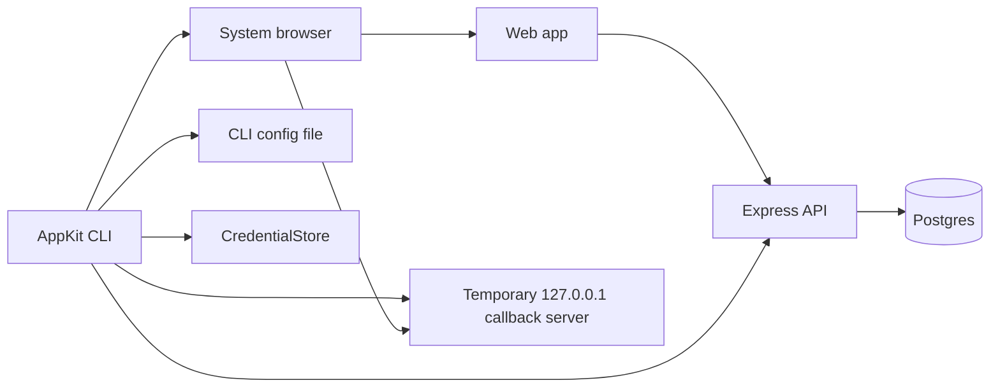
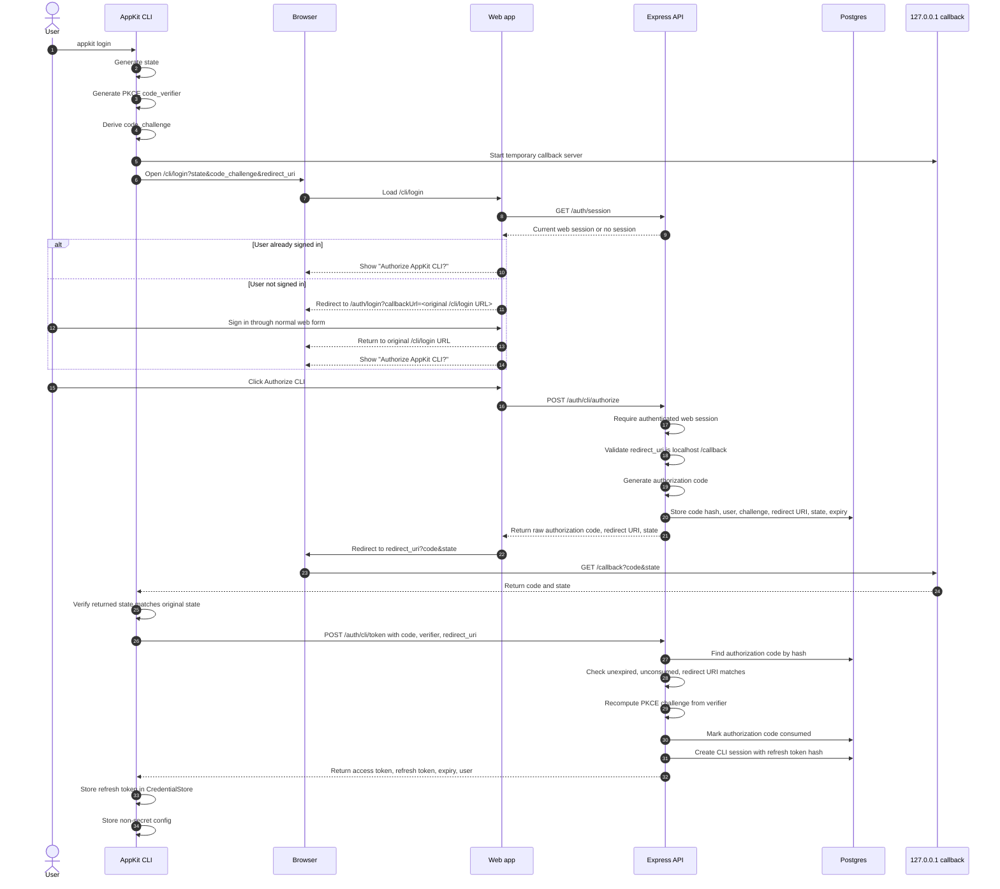
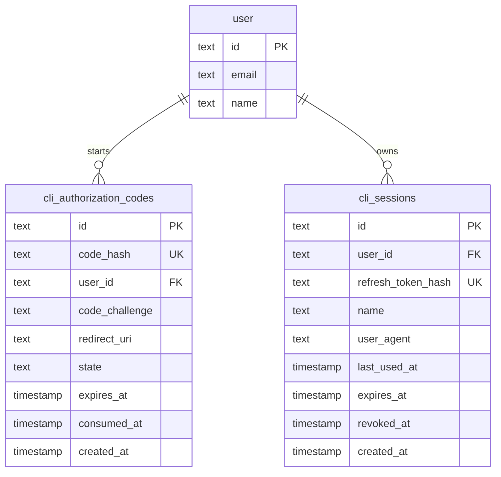
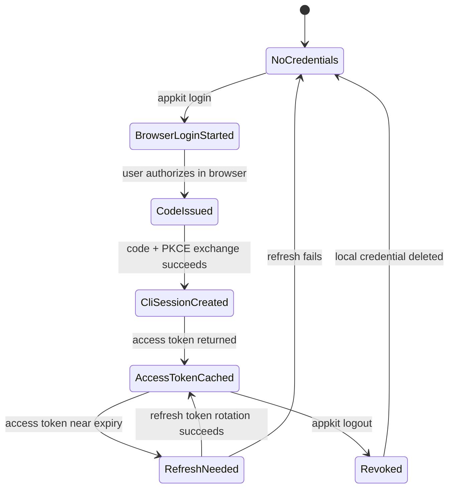
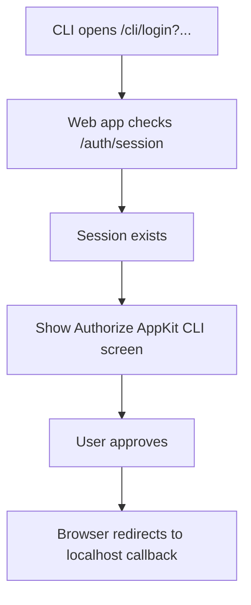
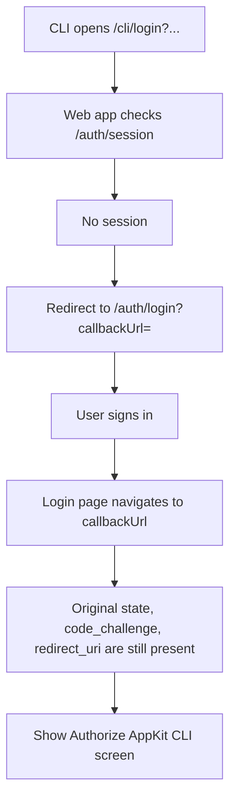

# CLI authentication

<!-- cspell:words PKCE pkce HMAC libsecret rundll autonumber -->

AppKit CLI authentication uses a browser-based native application flow:

- the CLI starts the login, but it never asks for the user's password
- the browser handles the normal web sign-in experience
- the browser session is never copied into the CLI
- the CLI receives its own authorization code, access token, and refresh token
- authorization codes and refresh tokens are stored only as hashes in the database
- refresh tokens can be rotated and revoked server-side

This is intentionally close to the OAuth 2.0 native app pattern described by
[RFC 8252: OAuth 2.0 for Native Apps](https://www.rfc-editor.org/rfc/rfc8252.html)
and [RFC 7636: Proof Key for Code Exchange](https://www.rfc-editor.org/rfc/rfc7636).

## User experience

The user runs:

```bash
appkit login
```

The CLI opens:

```txt
http://localhost:3000/cli/login?state=...&code_challenge=...&redirect_uri=http%3A%2F%2F127.0.0.1%3A63242%2Fcallback
```

If the user is already signed in to the web app, the browser immediately shows:

```txt
Authorize AppKit CLI?

The AppKit CLI is requesting access to luca@example.com.

[Authorize CLI] [Cancel]
```

If the user is not signed in, the web app redirects them through the existing sign-in page and then returns them to the original `/cli/login` URL with the original query params preserved.

After the user clicks **Authorize CLI**, the browser redirects to the temporary localhost callback server that the CLI is running:

```txt
http://127.0.0.1:63242/callback?code=...&state=...
```

The CLI validates the callback, exchanges the code for CLI tokens, stores the refresh token, and prints:

```txt
Logged in as luca@example.com
```

## Commands

```bash
appkit login
appkit login --no-browser
appkit login --api-url http://localhost:4000 --web-url http://localhost:3000
appkit whoami
appkit auth status
appkit logout
```

Development defaults come from `@appkit/config`:

- API: `http://localhost:4000`
- Web: `http://localhost:3000`

You can override them with environment variables:

```bash
APPKIT_API_URL=http://localhost:4000
APPKIT_WEB_URL=http://localhost:3000
```

Or with login flags:

```bash
appkit login --api-url http://localhost:4000 --web-url http://localhost:3000
```

## Components



### CLI

The CLI owns the native-app side of the flow:

- generates `state`
- generates a PKCE `code_verifier`
- derives a PKCE `code_challenge`
- starts a temporary HTTP server on `127.0.0.1:<random-port>`
- opens the user's normal browser to `/cli/login`
- waits for the browser to call back to `http://127.0.0.1:<port>/callback`
- validates `state`
- exchanges the authorization code plus `code_verifier` with the API
- stores the refresh token through `CredentialStore`
- stores non-secret config through `configStore`

Relevant code:

- `apps/cli/src/commands/login.ts`
- `apps/cli/src/auth/pkce.ts`
- `apps/cli/src/auth/localhost-callback-server.ts`
- `apps/cli/src/auth/credential-store.ts`
- `apps/cli/src/auth/token-manager.ts`

### Web app

The web app owns the browser authorization screen:

- reads `state`, `code_challenge`, and `redirect_uri` from the URL
- checks the normal Auth.js web session
- redirects unauthenticated users to `/auth/login`
- preserves the original `/cli/login?...` URL in `callbackUrl`
- shows the CLI authorization screen to authenticated users
- calls `POST /auth/cli/authorize`
- redirects the browser to the CLI localhost callback with `code` and `state`

Relevant code:

- `packages/frontend/src/pages/cli/login.tsx`
- `packages/frontend/src/pages/auth/login.tsx`
- `packages/frontend/src/routes.tsx`

### API

The API owns the server-side trust decisions:

- verifies that `/auth/cli/authorize` is called by an authenticated web user
- validates the localhost callback URL
- creates short-lived authorization codes
- stores only hashed authorization codes
- verifies PKCE during token exchange
- marks authorization codes as consumed
- creates CLI sessions
- stores only hashed refresh tokens
- issues short-lived access tokens
- rotates refresh tokens on refresh
- revokes CLI sessions on logout
- verifies access tokens for `GET /auth/me`

Relevant code:

- `apps/api/src/modules/auth/cli-auth.routes.ts`
- `apps/api/src/modules/auth/cli-auth.controller.ts`
- `apps/api/src/modules/auth/cli-auth.service.ts`
- `apps/api/src/modules/auth/cli-token.ts`
- `apps/api/src/db/schema/cliAuth.ts`

### Shared packages

Shared schemas and API wrappers keep request and response shapes consistent:

- `packages/core/src/auth/cli.schema.ts`
- `packages/api-client/src/auth/cli.ts`

## Complete login sequence



## Why this is secure

### Passwords stay out of the CLI

The CLI never asks for an email/password pair. The user signs in only through the normal web app. This means the CLI does not need to implement password handling, password reset edge cases, MFA prompts, or provider-specific flows.

### Browser cookies stay in the browser

The browser may already have an Auth.js session cookie. That cookie is used only by the web app and API to decide whether the browser user is signed in.

The CLI never reads that cookie. Instead, after explicit approval, the CLI receives its own CLI-specific tokens.

This matters because browser session cookies and CLI credentials have different life cycles, storage locations, and threat models.

### `state` protects the callback

`state` is a random value generated by the CLI before the browser is opened.

The CLI sends `state` to the web page:

```txt
/cli/login?state=abc...
```

Later, the browser callback must include the same value:

```txt
http://127.0.0.1:63242/callback?code=...&state=abc...
```

If the returned `state` does not match, the CLI stops the login.

This protects against cross-request confusion, where the CLI might otherwise accept a callback that belongs to a different login attempt.

### PKCE proves the same CLI finished the flow

PKCE stands for Proof Key for Code Exchange.

At login start, the CLI creates:

- `code_verifier`: a high-entropy secret that stays inside the CLI
- `code_challenge`: a SHA-256 derived value sent through the browser

The web app and API see only the `code_challenge` during authorization.

When the CLI exchanges the authorization code, it sends the original `code_verifier`.

The API computes:

```txt
base64url(sha256(code_verifier))
```

Then it compares that value with the stored `code_challenge`.

If someone intercepts the authorization code but does not have the original `code_verifier`, they cannot exchange the code for tokens.

### Authorization codes are short-lived and one-time-use

When the user authorizes the CLI, the API creates a random authorization code. The raw code is returned to the browser, but the database stores only:

```txt
sha256(code)
```

The code expires after 5 minutes.

During `/auth/cli/token`, the API:

1. hashes the submitted code
2. finds the matching database row
3. checks that it is not expired
4. checks that it was not already consumed
5. checks that the redirect URI matches
6. checks PKCE
7. sets `consumed_at`

After that, the same code cannot be reused.

### Redirect URI validation limits where codes can go

The API accepts only localhost callback URLs:

```txt
http://127.0.0.1:<port>/callback
http://localhost:<port>/callback
```

This prevents the browser from being redirected to arbitrary external sites with a CLI authorization code.

The CLI also sends the exact `redirectUri` again during token exchange. The API rejects the exchange if it does not match the stored redirect URI.

### Refresh tokens are hashed in the database

The raw refresh token is returned to the CLI once. The database stores only:

```txt
sha256(refreshToken)
```

When the CLI refreshes, the API hashes the submitted refresh token and looks up the matching session.

This mirrors password storage principles: if the database leaks, attackers do not immediately get usable raw refresh tokens.

### Refresh tokens rotate

On each refresh, the API:

1. validates the current refresh token hash
2. creates a new refresh token
3. replaces the old hash with the new hash
4. updates `last_used_at`
5. returns the new refresh token to the CLI

The CLI then overwrites its locally stored refresh token.

This reduces the value of an older stolen refresh token.

### Access tokens are short-lived

Access tokens expire after 15 minutes.

They contain:

- `sub`: user ID
- `sid`: CLI session ID
- `exp`: expiry timestamp

The token is signed with `AUTH_SECRET` using HMAC-SHA256. The API validates the signature and expiry before trusting it.

For `GET /auth/me`, the API also checks that the CLI session still exists, belongs to the same user, is not revoked, and is not expired.

### Logout revokes the server-side session

`appkit logout`:

1. reads the local refresh token
2. calls `POST /auth/cli/revoke`
3. the API hashes the refresh token
4. the API marks the matching CLI session as revoked
5. the CLI deletes its local refresh token
6. the CLI clears local user metadata

Revocation is server-side, so a deleted local token is not the only protection.

## Data model



### `cli_authorization_codes`

This table is temporary handshake state.

| Column           | Purpose                                                              |
| ---------------- | -------------------------------------------------------------------- |
| `code_hash`      | Hash of the one-time authorization code. The raw code is not stored. |
| `user_id`        | The web user who approved CLI access.                                |
| `code_challenge` | PKCE challenge derived from the CLI-only verifier.                   |
| `redirect_uri`   | The exact localhost callback URI the CLI is listening on.            |
| `state`          | Random login attempt identifier generated by the CLI.                |
| `expires_at`     | Five-minute expiry.                                                  |
| `consumed_at`    | Set once the code is exchanged, preventing reuse.                    |

### `cli_sessions`

This table represents long-lived CLI login state.

| Column               | Purpose                                                |
| -------------------- | ------------------------------------------------------ |
| `refresh_token_hash` | Hash of the current refresh token.                     |
| `user_id`            | The user this CLI session belongs to.                  |
| `name`               | Human-readable session name, currently `AppKit CLI`.   |
| `user_agent`         | Optional caller user agent from token exchange.        |
| `last_used_at`       | Updated during refresh.                                |
| `expires_at`         | Refresh session expiry, currently 30 days.             |
| `revoked_at`         | Set by logout or future admin/device management flows. |

## Endpoint behavior

### `POST /auth/cli/authorize`

Called by the web app after the user clicks **Authorize CLI**.

Requires an authenticated web session.

Request:

```json
{
  "codeChallenge": "base64url-sha256-value",
  "redirectUri": "http://127.0.0.1:63242/callback",
  "state": "random-state"
}
```

Server behavior:

1. validates the request with `cliAuthorizeRequestSchema`
2. ensures the browser has an authenticated Auth.js session
3. validates that `redirectUri` is a localhost `/callback` URL
4. creates a random authorization code
5. stores only `sha256(code)`
6. stores the user, challenge, redirect URI, state, and expiry
7. returns the raw code to the web app

Response:

```json
{
  "code": "raw-one-time-code",
  "redirectUri": "http://127.0.0.1:63242/callback",
  "state": "random-state"
}
```

The web app then redirects the browser to:

```txt
http://127.0.0.1:63242/callback?code=raw-one-time-code&state=random-state
```

### `POST /auth/cli/token`

Called by the CLI after the localhost callback succeeds.

Request:

```json
{
  "code": "raw-one-time-code",
  "codeVerifier": "cli-only-secret-verifier",
  "redirectUri": "http://127.0.0.1:63242/callback"
}
```

Server behavior:

1. hashes `code`
2. finds an unconsumed authorization code row
3. rejects expired codes
4. rejects consumed codes
5. rejects redirect URI mismatches
6. recomputes the PKCE challenge from `codeVerifier`
7. rejects PKCE mismatches
8. marks the code consumed
9. creates a CLI session
10. stores only `sha256(refreshToken)`
11. creates a short-lived access token
12. returns tokens and basic user info

Response:

```json
{
  "accessToken": "short-lived-signed-token",
  "refreshToken": "longer-lived-random-secret",
  "expiresAt": "2026-05-14T03:35:15.324Z",
  "user": {
    "id": "user-id",
    "name": "Luca Mezzavilla",
    "email": "lucamezza4@gmail.com",
    "image": null
  }
}
```

### `POST /auth/cli/refresh`

Called by the CLI token manager when it needs an access token.

Request:

```json
{
  "refreshToken": "current-refresh-token"
}
```

Server behavior:

1. hashes the submitted refresh token
2. finds a non-revoked CLI session
3. rejects expired sessions
4. creates a fresh access token
5. creates a new refresh token
6. replaces the stored refresh token hash
7. updates `last_used_at`

Response:

```json
{
  "accessToken": "new-short-lived-token",
  "refreshToken": "rotated-refresh-token",
  "expiresAt": "2026-05-14T03:50:15.324Z",
  "user": {
    "id": "user-id",
    "name": "Luca Mezzavilla",
    "email": "lucamezza4@gmail.com",
    "image": null
  }
}
```

### `POST /auth/cli/revoke`

Called by `appkit logout`.

Request:

```json
{
  "refreshToken": "current-refresh-token"
}
```

Server behavior:

1. hashes the refresh token
2. marks the matching CLI session as revoked
3. returns success even if there is nothing useful left to revoke

Response:

```json
{
  "revoked": true
}
```

### `GET /auth/me`

Called by `appkit whoami` and `appkit auth status`.

Request:

```txt
Authorization: Bearer <accessToken>
```

Server behavior:

1. verifies the access token signature
2. verifies the access token expiry
3. reads `sub` and `sid`
4. checks the CLI session exists
5. checks the CLI session is not revoked
6. checks the CLI session belongs to the same user
7. returns the current user

Response:

```json
{
  "user": {
    "id": "user-id",
    "name": "Luca Mezzavilla",
    "email": "lucamezza4@gmail.com",
    "image": null
  }
}
```

## Token lifecycle



### Authorization code

- lifetime: 5 minutes
- storage: database hash only
- reuse: impossible after `consumed_at` is set
- purpose: short bridge from browser approval to CLI token exchange

### Access token

- lifetime: 15 minutes
- storage: memory only in the CLI process
- format: base64url payload plus HMAC-SHA256 signature
- purpose: authenticate normal CLI API calls

### Refresh token

- lifetime: 30 days
- storage on client: `CredentialStore`
- storage on server: database hash only
- rotation: replaced on every refresh
- purpose: obtain short-lived access tokens without asking the user to log in again

## Already signed in vs not signed in

### Already signed in



The user does not see the sign-in form. Their existing browser session proves who they are to the web app.

### Not signed in



Preserving the exact callback URL matters because the CLI is waiting for a specific `state`, PKCE challenge, and localhost callback URI.

## Local storage

The CLI intentionally separates non-secret configuration from secret credentials.

### Non-secret config

Stored through `configStore`.

Example:

```json
{
  "apiUrl": "http://localhost:4000",
  "webUrl": "http://localhost:3000",
  "userId": "user-id",
  "userEmail": "luca@example.com",
  "userName": "Luca Mezzavilla"
}
```

This is not enough to authenticate as the user.

### Secret credential

Stored through `CredentialStore`.

Current implementation:

- stores the refresh token in a filesystem fallback
- prints a warning when that fallback is used
- keeps the interface ready for OS keychain implementations

Production distributions should replace the fallback with:

- Windows Credential Manager
- macOS Keychain
- Linux Secret Service/libsecret

## Failure cases

### Missing query params

The web page shows:

```txt
CLI authorization failed
The login request is missing required parameters.
```

This means `/cli/login` did not receive all of:

- `state`
- `code_challenge`
- `redirect_uri`

On Windows this can happen if a browser is opened through a shell command that treats `&` as command syntax. The CLI uses `rundll32 url.dll,FileProtocolHandler` to avoid that.

### `relation "cli_authorization_codes" does not exist`

The API code is running, but the database migration has not been applied.

Run:

```bash
pnpm --filter @appkit/api db:migrate
```

If the command cannot see `DATABASE_URL`, load the root `.env` when running Drizzle.

### State mismatch

The CLI received a callback with the wrong `state`.

The CLI rejects the login because it cannot prove the callback belongs to the login attempt it started.

### Expired authorization code

Authorization codes expire after 5 minutes.

Restart the login:

```bash
appkit login
```

### Reused authorization code

Authorization codes are marked consumed during token exchange.

If the same code is submitted again, the API rejects it.

### Revoked or expired refresh token

The CLI cannot refresh its access token.

The user should run:

```bash
appkit login
```

## Security checklist

- Passwords are never entered into the CLI.
- Browser session cookies are never copied into the CLI.
- The browser uses the existing web sign-in flow.
- The user explicitly approves CLI access.
- `state` is generated by the CLI and verified on callback.
- PKCE binds the authorization code to the original CLI process.
- Redirect URIs are restricted to localhost callback URLs.
- Authorization codes are short-lived.
- Authorization codes are single-use.
- Authorization code values are hashed in the database.
- Refresh token values are hashed in the database.
- Refresh tokens rotate on refresh.
- Access tokens are short-lived.
- Logout revokes the server-side CLI session.
- Local secret storage is abstracted behind `CredentialStore`.

## How to test the flow locally

1. Start Postgres:

```bash
pnpm db:up
```

2. Apply migrations:

```bash
pnpm --filter @appkit/api db:migrate
```

3. Start the API:

```bash
pnpm dev:api
```

4. Start the web app:

```bash
pnpm dev:web
```

5. Start login:

```bash
pnpm --filter @appkit/cli dev -- login
```

6. Approve in the browser.

7. Check the signed-in user:

```bash
pnpm --filter @appkit/cli dev -- whoami
```

8. Check status:

```bash
pnpm --filter @appkit/cli dev -- auth status
```

9. Logout:

```bash
pnpm --filter @appkit/cli dev -- logout
```

## Related reading

- [RFC 8252: OAuth 2.0 for Native Apps](https://www.rfc-editor.org/rfc/rfc8252.html)
- [RFC 7636: Proof Key for Code Exchange](https://www.rfc-editor.org/rfc/rfc7636)
- [OAuth.net PKCE overview](https://oauth.net/2/pkce/)
- [OAuth 2.0 for Browser-Based Apps](https://www.rfc-editor.org/rfc/rfc9449.html)
- [Auth.js Express reference](https://authjs.dev/reference/express)
